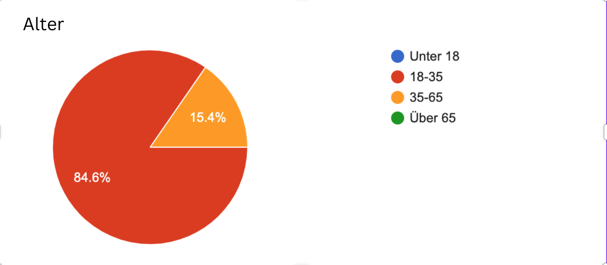
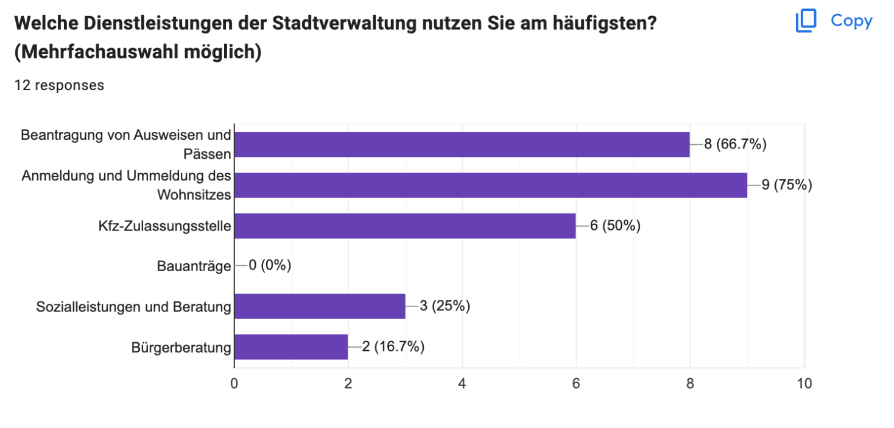
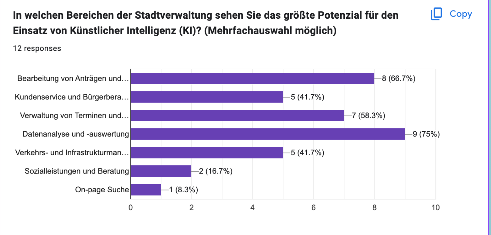
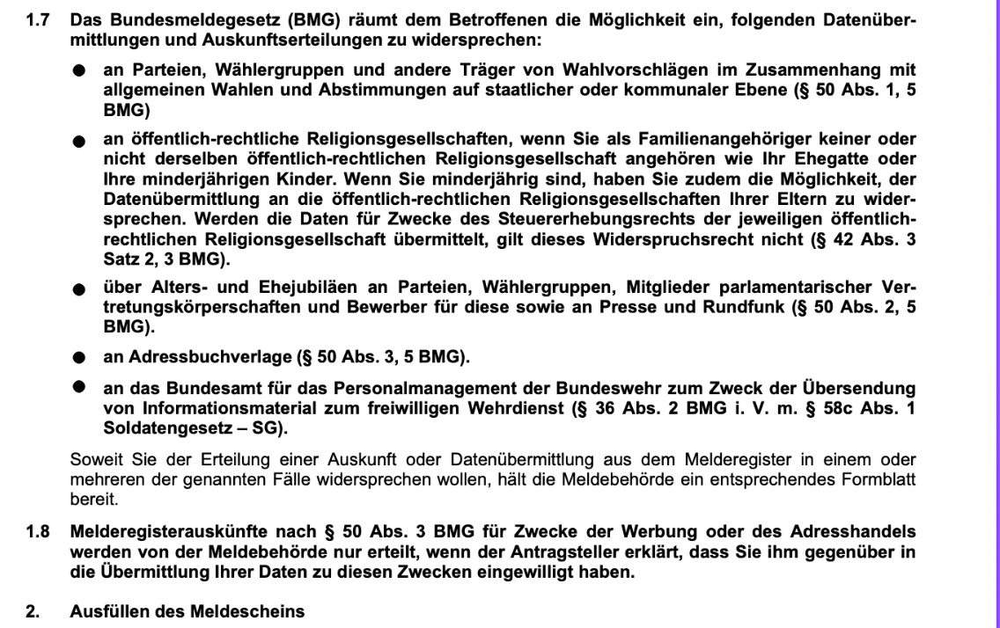
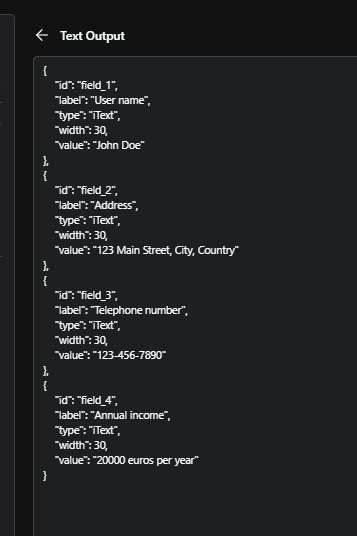
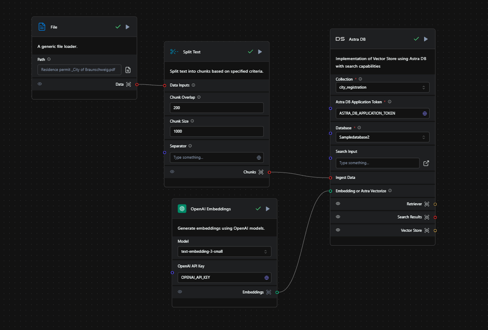
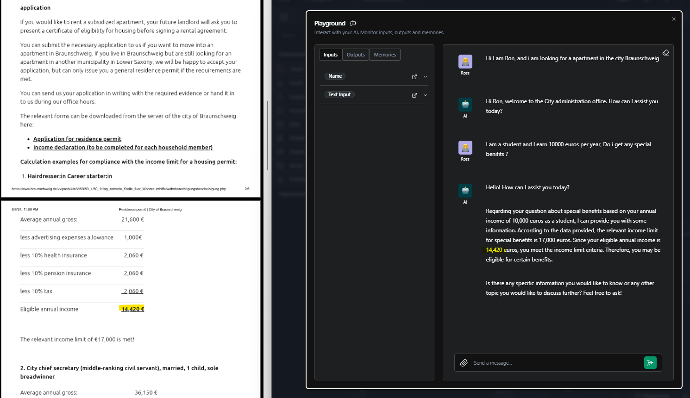

# ThinkAI
As engineers, our goal is to address real-world challenges. To achieve this, we conducted research to identify the specific problems Braunschweig residents encounter when dealing with forms. Our findings are as follows:


The people who took our survey are in these age groups

And they strugled with such things: 


- - - 
Like who can understand this?! 


- - - - 
So because navigating the web online municipal services are complex. Our goal was to simplify this process by developing an intelligent chatbot that acts as a virtual assistant for accessing and using the city's online services.

Imagine you've just moved to Braunschweig and you're unsure about the next steps. Instead of sifting through the service portal of the city, you can simply engage with our chatbot. For example, you might say, "I just moved to Braunschweig, what should I do?" The chatbot would then guide you through the necessary steps, such as registering at the Rathaus.

But it doesn't stop there—the chatbot goes further by providing the relevant forms you need to fill out. It assists you in completing these forms by asking a series of questions and automatically populating the form with your answers. Once completed, you can easily print the form, sign it, and submit it.

- - -

**Key Features**

* **Form Identification:** Users says what service he wants to use, and the chatbot will suggest potential matches of forms.
* **Form Guidance:** The chatbot will provide step-by-step instructions on how to fill out the form.
* **Information Retrieval:** The chatbot can access relevant information from external sources to assist users.
* **Error Handling:** The chatbot can identify and correct common errors in form completion.
- - - 


 
- - - 
**Technology Stack**

**Backend**:
AstraDB (Vector Database):
cloud-native database designed to manage and scale distributed data effortlessly.
+ Langflow:
A modular language processing library that simplifies the integration of NLP (Natural Language Processing) capabilities into applications. 
+ OpenAI API ChatGPT 4.0 Turbo:
Used it for data retrievel from PDF files. And acctually make manage the conversation flow.
why using it ?
simply beacause they are already have there own GPT so they can use our solution and simply bind it with there API 

+ Python:
Used as our main programming language.

**Frontend:**
+ Next.js:


**Data**
* Braunschweig official website

## Getting Started

First, run the development server:

```bash
npm run dev
# or
yarn dev
# or
pnpm dev
# or
bun dev
```

Open [http://localhost:3000](http://localhost:3000) with your browser to see the result.

You can start editing the page by modifying `app/page.tsx`. The page auto-updates as you edit the file.

This project uses [`next/font`](https://nextjs.org/docs/basic-features/font-optimization) to automatically optimize and load Inter, a custom Google Font.


**Presentation link**
https://www.canva.com/design/DAGNRIfn9hs/XRWoRBn4Fc_ZV5vcqw4O2g/edit?utm_content=DAGNRIfn9hs&utm_campaign=designshare&utm_medium=link2&utm_source=sharebutton

